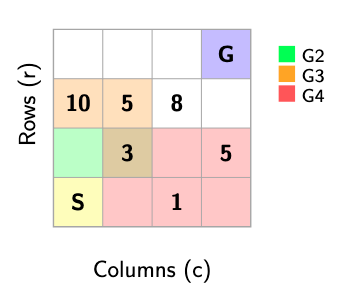
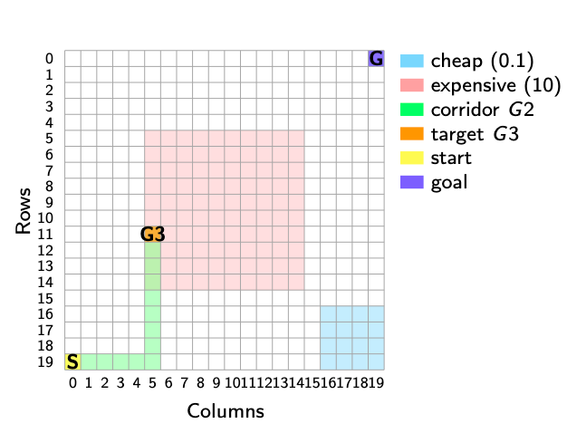

# pctl_idual

This repository provides:
- a GridWorld Markov Decision Process (MDP) framework,
- a Dynamic Programming (DP) solver for shortest-path problems (ground truth),
- a Linear Programming (LP) solver for shortest-path problems (ground truth) with PCTL constraints,
- i-dual–based solver with PCTL constraints.

The DP solver serves as an unconstrained baseline and ground truth
against which LP and i-dual methods are compared.

---

## 1. GridWorld MDP

We consider a finite-state GridWorld MDP where:
- states are grid cells `(row, col)`,
- actions move the agent in the four cardinal directions,
- transitions may be stochastic (slip probability),
- costs are incurred per cell (with optional rectangular cost regions),
- goal states are absorbing.

### Example GridWorld (4×4)


**State space:** grid cells `(row, col)`  
**Actions:** up, down, left, right  
**Start state:** `S = (3, 0)`  
**Goal state:** `G = (0, 3)` (absorbing)

**Cost structure**
- Four highlighted cells (shown in the figure) have **non-unit costs**
- All remaining cells have default cost **1**

This example is used as a small-scale sanity check for the Dynamic
Programming (DP) shortest-path solver.

### Example GridWorld (20×20)


**State space:** grid cells `(row, col)`  
**Actions:** up, down, left, right  
**Start state:** `S = (19, 0)`  
**Goal state:** `G = (0, 19)` (absorbing)

**Cost structure**
- **Blue region (L):** low-cost cells, cost **0.1**
- **Red region (H):** high-cost cells, cost **10**
- **All remaining cells:** default cost **1**

This example demonstrates how heterogeneous cost regions influence the
optimal policy, which avoids high-cost regions whenever possible.

---

## 2. Dynamic Programming (Ground Truth)

The value function V(s) satisfies the Bellman optimality equation:

V(s) = min_a sum_{s'} P(s' | s, a) [ c(s, a, s') + V(s') ].

The DP solver iterates this update until convergence.

---

## 3. Running a DP experiment

### Step 1: Create a YAML config (as an example, we can create the grid 20x20 (not including the G2 and G3 areas yet)

```yaml
exp_name: dp_custom

mdp:
  world: "custom"
  N: 20
  start: [19, 0]
  goal: [[0, 19]]
  slip_prob: 0.0
  default_cost: 1.0
  rect_costs:
    - [16, 16, 19, 19, 0.1] #cheap block
    - [5, 5, 14, 14, 10.0] #expensive block \

```

### Step 2: Run the experiment

```bash
python scripts/run_experiment.py --config configs/dp_custom.yaml
```
### Output

The script prints:

- the optimal expected cost from the start state,

- a trajectory generated by the greedy DP policy.

#### Example output for the 4x4 grid:

**DP (unconstrained) optimal cost from START:** `10.0`  

**Trajectory under DP (unconstrained):**  
`[(3, 0), (2, 0), (2, 1), (2, 2), (1, 2), (0, 2), (0, 3)]`


#### Example output for the 20x20 grid:

**DP (unconstrained) optimal cost from START:** ` 31.70000000000001`

**Trajectory under DP (unconstrained):**
`[(19, 0), (19, 1), (19, 2), (19, 3), (19, 4), (19, 5), (19, 6), (19, 7), (19, 8), (19, 9), (19, 10), (19, 11), (19, 12), (19, 13), (19, 14), (19, 15), (19, 16), (18, 16), (17, 16), (16, 16), (16, 17), (16, 18), (16, 19), (15, 19), (14, 19), (13, 19), (12, 19), (11, 19), (10, 19), (9, 19), (8, 19), (7, 19), (6, 19), (5, 19), (4, 19), (3, 19), (2, 19), (1, 19), (0, 19)]`

## 4. Linear Programming 

The LP formulation uses occupation measures to compute shortest paths.

#### Example LP configuration

```yaml
exp_name: lp_custom

mdp:
  world: "custom" #"4x4", "20x20"
  N: 20
  start: [19, 0]
  goal: [[0, 19]]
  slip_prob: 0.0
  default_cost: 1.0
  rect_costs:
    - [16, 16, 19, 19, 0.1]   # cheap block
    - [5, 5, 14, 14, 10.0]    # expensive block
run:
  solver: "lp"   # dp | lp | both
lp:
  solver: "MOSEK"     # MOSEK | HIGHS | DEFAULT
```

### Optional: MOSEK (faster LP/QP solves)

If you have a MOSEK license, set:

```bash
export MOSEKLM_LICENSE_FILE="/path/to/mosek.lic"
```

Otherwise, CVXPY will fall back to open-source solvers (SCS/OSQP/ECOS),
which may be slower.

#### LP Output Example

```bash
LP cost: 31.700000000708798

solve time: 0.07632921205367893
```

#### Extracted policy visualization

```
 ·   ·   ·   ·   ·   ·   ·   ·   ·   ·   ·   ·   ·   ·   ·   ·   ·   ·   ·   G 
 ·   ·   ·   ·   ·   ·   ·   ·   ·   ·   ·   ·   ·   ·   ·   ·   ·   ·   ·   ↑  
 ·   ·   ·   ·   ·   ·   ·   ·   ·   ·   ·   ·   ·   ·   ·   ·   ·   ·   ·   ↑  
 ·   ·   ·   ·   ·   ·   ·   ·   ·   ·   ·   ·   ·   ·   ·   ·   ·   ·   ·   ↑  
 ·   ·   ·   ·   ·   ·   ·   ·   ·   ·   ·   ·   ·   ·   ·   ·   ·   ·   ·   ↑  
 ·   ·   ·   ·   ·   ·   ·   ·   ·   ·   ·   ·   ·   ·   ·   ·   ·   ·   ·   ↑  
 ·   ·   ·   ·   ·   ·   ·   ·   ·   ·   ·   ·   ·   ·   ·   ·   ·   ·   ·   ↑  
 ·   ·   ·   ·   ·   ·   ·   ·   ·   ·   ·   ·   ·   ·   ·   ·   ·   ·   ·   ↑  
 ·   ·   ·   ·   ·   ·   ·   ·   ·   ·   ·   ·   ·   ·   ·   ·   ·   ·   ·   ↑  
 ·   ·   ·   ·   ·   ·   ·   ·   ·   ·   ·   ·   ·   ·   ·   ·   ·   ·   ·   ↑  
 ·   ·   ·   ·   ·   ·   ·   ·   ·   ·   ·   ·   ·   ·   ·   ·   ·   ·   ·   ↑  
 ·   ·   ·   ·   ·   ·   ·   ·   ·   ·   ·   ·   ·   ·   ·   ·   ·   ·   ·   ↑  
 ·   ·   ·   ·   ·   ·   ·   ·   ·   ·   ·   ·   ·   ·   ·   ·   ·   ·   ·   ↑  
 ·   ·   ·   ·   ·   ·   ·   ·   ·   ·   ·   ·   ·   ·   ·   ·   ·   ·   ·   ↑  
 ·   ·   ·   ·   ·   ·   ·   ·   ·   ·   ·   ·   ·   ·   ·   ·   ·   ·   ·   ↑  
 ·   ·   ·   ·   ·   ·   ·   ·   ·   ·   ·   ·   ·   ·   ·   ·   ·   ·   ·   ↑  
 ·   ·   ·   ·   ·   ·   ·   ·   ·   ·   ·   ·   ·   ·   ·   ·   →   →   →   ↑  
 ·   ·   ·   ·   ·   ·   ·   ·   ·   ·   ·   ·   ·   ·   ·   ·   ↑   →   →   ↑  
 ·   ·   ·   ·   ·   ·   ·   ·   ·   ·   ·   ·   ·   ·   ·   ·   ↑   →   →   ↑  
 S   →   →   →   →   →   →   →   →   →   →   →   →   →   →   →   ↑   →   ↑   ·  
```

## 5. Linear Programming with PCTL constraints

**GridWorld layout and regions**

**Start:** `S = (3,0`)

**Goal:** `G = (0,3)` (absorbing)

Cell costs are heterogeneous

Regions:

**G2:** `row 2, cols 0–1`

**G3:** `row 1, cols 0–1`

**G4:** `rows 2–3, cols 1–3`

(Note: regions may overlap, e.g., G2 ∩ G4 ≠ ∅)



#### Example LP configuration with PCTL constraints

```yaml
mdp:
  world: "4x4_pctl"   

run:
  solver: "pctl_lp"

lp:
  solver: "MOSEK"     # MOSEK | HIGHS | DEFAULT

pctl:
  p_goal_min: 1.0

  # Define named regions (flags)
  flags:
    - name: "G2"
      region:
        rect: [2, 0, 2, 1]     # row 2, cols 0..1
    - name: "G3"
      region:
        rect: [1, 0, 1, 1]     # row 1, cols 0..1
    - name: "G4"
      region:
        rect: [2, 1, 3, 3]     # rows 2..3, cols 1..3

  # Define Until specs by name
  until_specs:
    - name: "G2U_G3"
      A: "G2"
      B: "G3"

  # Region constraints
  region_constraints: []
  # - type: "visit_region_max"
  #   region: "G4"
  #   p: 0.0

  # Until constraints
  until_constraints: 

  - type: "until_min"
    until: "G2U_G3"
    p: 0.7
```

## PCTL Correctness Demonstrations

### Baseline 4×4 Grid (no PCTL)

**What we do:**  We solve the LP without any PCTL region or until constraints, enforcing only:

`P(◊GOAL)=1`

This serves as the unconstrained ground truth.

**What we expect:** The policy minimizes expected cost, no preference for visiting G2 or G3, G4 may be visited if it is cost-optimal

**What we observe:** Optimal cost: 10.0, P(G2U_G3) ≈ 0, policy takes the shortest path to the goal

This confirms that the LP solver reproduces the unconstrained optimum.

```
=== Global LP with PCTL + Until ===
Optimal expected cost: 10.000000000205741
P(reach GOAL): 1.0000000000034321
P(ever visit G2): 7.102447589347438e-12
P(ever visit G4): 1.0000000000009337
P(ever visit G3): 4.648578719501556e-12
P(G2U_G3): 3.390368501480557e-12
Time taken to solve dual LP: 0.047 s

Trajectory under PCTL-constrained policy (base states): [(3, 0), (3, 1), (3, 2), (2, 2), (2, 3), (1, 3), (0, 3)]

Final policy (collapsed to base MDP):
 ·   ·   ·   G  
 ·   ·   ·   ↑  
 ·   ·   →   ↑  
 S   →   ↑   ·  
```
 ### Region avoidance (hard constraint)
 
 `P(ever visit G4) ≤ 0`

**What we expect:** The policy must avoid G4 entirely, cost may increase due to detours, reachability of the goal must still be guaranteed

**What we observe:** P(visit G4) = 0, cost increases from 10.0 → 15.0, policy reroutes along the left edge, P(G2U_G3) ≈ 1 emerges as a consequence, not a requirement

This demonstrates that region constraints are enforced exactly and meaningfully alter the policy.

```
 === Global LP with PCTL + Until ===
Optimal expected cost: 15.000000000001585
P(reach GOAL): 1.0000000000000144
P(ever visit G2): 1.0000000000000036
P(ever visit G4): 0.0
P(ever visit G3): 1.000000000000003
P(G2U_G3): 0.9999999999999674
Time taken to solve dual LP: 0.046 s

Trajectory under PCTL-constrained policy (base states): [(3, 0), (2, 0), (1, 0), (0, 0), (0, 1), (0, 2), (0, 3)]

Final policy (collapsed to base MDP):
 →   →   →   G  
 ↑   ·   ·   ·  
 ↑   ·   ·   ·  
 S   ·   ·   · 
```
 ### Until constraint

 `P ≥ 0.7 [ G2 U G3 ]`
 
`With probability at least 0.7, the agent must remain in G2 until it reaches G3.`

**What we expect:** The policy must deliberately route through G2, reaching G3 before leaving G2 becomes prioritized, the constraint should bind tightly

**What we observe:** P(G2U_G3) ≈ 0.7 (tight), P(visit G2) ≈ 0.7, P(visit G3) ≈ 0.7, cost increases moderately: 10.0 → 11.4, policy explicitly enforces the G2 → G3 ordering

This confirms the semantic correctness of the until operator in the LP formulation.

```
=== Global LP with PCTL + Until ===
Optimal expected cost: 11.40000000000045
P(reach GOAL): 1.0000000000000173
P(ever visit G2): 0.7000000000000306
P(ever visit G4): 1.0000000000000122
P(ever visit G3): 0.7000000000000218
P(G2U_G3): 0.7000000000000184
Time taken to solve dual LP: 0.045 s

Trajectory under PCTL-constrained policy (base states): [(3, 0), (2, 0), (2, 1), (1, 1), (0, 1), (0, 2), (0, 3)]

Final policy (collapsed to base MDP):
 ·   →   →   G  
 ·   ↑   ·   ↑  
 →   ↑   →   ↑  
 S   →   ↑   ·
```

### 20×20 Grid: Scaling demo (corridor Until constraint)

This experiment demonstrates that the LP+PCTL formulation works beyond the toy 4×4 case.
We define a **non-rectangular corridor region** `G2` (represented as a union of rectangles in YAML)
and a single-cell region `G3 = {(11,5)}`. We then enforce the probabilistic until constraint:

`P ≥ 0.7 [ G2 U G3 ]`



**Interpretation:** with probability at least 0.7, the agent must stay in the corridor `G2`
until it reaches the target cell `G3`.

**What we expect**
- The solver should return a feasible policy.
- The reported probability `P(G2U_G3)` should be close to `0.7` (often tight).
- A typical trajectory should follow the corridor to reach `(11,5)` before heading to the goal.
- Runtime should increase compared to 4×4, motivating incremental methods (i-dual).

**What we observe**

```
=== Global LP with PCTL + Until ===
Optimal expected cost: 62.710000176519415
P(reach GOAL): 1.0000000008051315
P(ever visit G2): 1.0000000001403015
P(ever visit G3): 0.6999999997825497
P(G2U_G3): 0.7000000000745663
Time taken to solve dual LP: 4.157 s

Trajectory under PCTL-constrained policy (base states): [(19, 0), (19, 1), (19, 2), (19, 3), (19, 4), (19, 5), (18, 5), (17, 5), (16, 5), (15, 5), (14, 5), (13, 5), (12, 5), (11, 5), (11, 4), (10, 4), (9, 4), (8, 4), (7, 4), (6, 4), (5, 4), (4, 4), (4, 5), (4, 6), (4, 7), (4, 8), (4, 9), (4, 10), (4, 11), (4, 12), (4, 13), (4, 14), (4, 15), (4, 16), (4, 17), (4, 18), (4, 19), (3, 19), (2, 19), (1, 19), (0, 19)]

Final policy (collapsed to base MDP):
 ·   ·   ·   ·   ·   ·   ·   ·   ·   →   →   →   →   →   →   →   →   →   →   G  
 ·   ·   ·   ·   →   →   →   →   →   →   →   →   →   →   →   →   →   →   →   ↑  
 ·   ·   ·   ·   ↑   →   →   →   →   →   →   →   →   →   →   →   →   →   →   ↑  
 ·   ·   ·   ·   →   →   →   →   →   →   →   →   →   →   →   →   →   →   →   ↑  
 ·   ·   ·   ·   →   →   →   →   →   →   →   →   →   →   →   →   →   →   →   ↑  
 ·   ·   ·   ·   ↑   ·   ·   ·   ·   ·   ·   ·   ·   ·   ·   ·   ·   ·   ·   ↑  
 ·   ·   ·   ·   ↑   ·   ·   ·   ·   ·   ·   ·   ·   ·   ·   ·   ·   ·   ·   ↑  
 ·   ·   ·   ·   ↑   ·   ·   ·   ·   ·   ·   ·   ·   ·   ·   ·   ·   ·   ·   ↑  
 ·   ·   ·   ·   ↑   ·   ·   ·   ·   ·   ·   ·   ·   ·   ·   ·   ·   ·   ·   ↑  
 ·   ·   ·   ·   ↑   ·   ·   ·   ·   ·   ·   ·   ·   ·   ·   ·   ·   ·   ·   ↑  
 ·   ·   ·   ·   ↑   ·   ·   ·   ·   ·   ·   ·   ·   ·   ·   ·   ·   ·   ·   ↑  
 ·   ·   ·   ·   ↑   ←   ·   ·   ·   ·   ·   ·   ·   ·   ·   ·   ·   ·   ·   ↑  
 ·   ·   ·   ·   ·   ↑   ·   ·   ·   ·   ·   ·   ·   ·   ·   ·   ·   ·   ·   ↑  
 ·   ·   ·   ·   ·   ↑   ·   ·   ·   ·   ·   ·   ·   ·   ·   ·   ·   ·   ·   ↑  
 ·   ·   ·   ·   ·   ↑   ·   ·   ·   ·   ·   ·   ·   ·   ·   ·   ·   ·   ·   ↑  
 ·   ·   ·   ·   ·   ↑   ·   ·   ·   ·   ·   ·   ·   ·   ·   ·   ·   ·   ·   ↑  
 ·   ·   ·   ·   ·   ↑   ·   ·   ·   ·   ·   ·   ·   ·   ·   ·   →   →   →   ↑  
 ·   ·   ·   ·   ·   ↑   ·   ·   ·   ·   ·   ·   ·   ·   ·   ·   →   →   ↑   ↑  
 ·   ·   ·   ·   ·   ↑   ·   ·   ·   ·   ·   ·   ·   ·   ·   ·   ↑   →   ↑   ↑  
 S   →   →   →   →   ↑   →   →   →   →   →   →   →   →   →   →   ↑   →   ↑   ↑
```
## 6. I-Dual Programming with PCTL constraints


