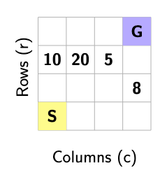
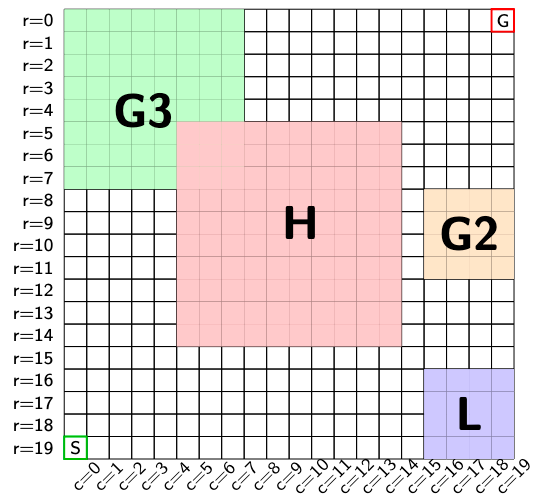

# pctl_idual

This repository provides:
- a GridWorld Markov Decision Process (MDP) framework,
- a Dynamic Programming (DP) solver for shortest-path problems (ground truth),
- a Linear Programming (LP) solver for shortest-path problems (ground truth) with PCTL constraints,
- i-dual–based solver with PCTL constraints.

The DP solver serves as an unconstrained baseline and ground truth
against which LP and i-dual methods are compared.

---

## 1. GridWorld MDP

We consider a finite-state GridWorld MDP where:
- states are grid cells `(row, col)`,
- actions move the agent in the four cardinal directions,
- transitions may be stochastic (slip probability),
- costs are incurred per cell (with optional rectangular cost regions),
- goal states are absorbing.

### Example GridWorld (4×4)



**State space:** grid cells `(row, col)`  
**Actions:** up, down, left, right  
**Start state:** `S = (3, 0)`  
**Goal state:** `G = (0, 3)` (absorbing)

**Cost structure**
- Four highlighted cells (shown in the figure) have **non-unit costs**
- All remaining cells have default cost **1**

This example is used as a small-scale sanity check for the Dynamic
Programming (DP) shortest-path solver.

### Example GridWorld (20×20)



**State space:** grid cells `(row, col)`  
**Actions:** up, down, left, right  
**Start state:** `S = (19, 0)`  
**Goal state:** `G = (0, 19)` (absorbing)

**Cost structure**
- **Blue region (L):** low-cost cells, cost **0.1**
- **Red region (H):** high-cost cells, cost **10**
- **All remaining cells:** default cost **1**

This example demonstrates how heterogeneous cost regions influence the
optimal policy, which avoids high-cost regions whenever possible.

---

## 2. Dynamic Programming (Ground Truth)

The value function V(s) satisfies the Bellman optimality equation:

V(s) = min_a sum_{s'} P(s' | s, a) [ c(s, a, s') + V(s') ].

The DP solver iterates this update until convergence.

---

## 3. Running a DP experiment

### Step 1: Create a YAML config (as an example, we can create the grid 20x20 (not including the G2 and G3 areas yet)

```yaml
exp_name: dp_custom

mdp:
  world: "custom"
  N: 20
  start: [19, 0]
  goal: [[0, 19]]
  slip_prob: 0.0
  default_cost: 1.0
  rect_costs:
    - [16, 16, 19, 19, 0.1] #cheap block
    - [5, 5, 14, 14, 10.0] #expensive block \

```

### Step 2: Run the experiment

```bash
python scripts/run_experiment.py --config configs/dp_custom.yaml
```
### Output

The script prints:

- the optimal expected cost from the start state,

- a trajectory generated by the greedy DP policy.

#### Example output for the 4x4 grid:

**DP (unconstrained) optimal cost from START:** `10.0`  

**Trajectory under DP (unconstrained):**  
`[(3, 0), (2, 0), (2, 1), (2, 2), (1, 2), (0, 2), (0, 3)]`


#### Example output for the 20x20 grid:

**DP (unconstrained) optimal cost from START:** ` 31.70000000000001`

**Trajectory under DP (unconstrained):**
`[(19, 0), (19, 1), (19, 2), (19, 3), (19, 4), (19, 5), (19, 6), (19, 7), (19, 8), (19, 9), (19, 10), (19, 11), (19, 12), (19, 13), (19, 14), (19, 15), (19, 16), (18, 16), (17, 16), (16, 16), (16, 17), (16, 18), (16, 19), (15, 19), (14, 19), (13, 19), (12, 19), (11, 19), (10, 19), (9, 19), (8, 19), (7, 19), (6, 19), (5, 19), (4, 19), (3, 19), (2, 19), (1, 19), (0, 19)]`


